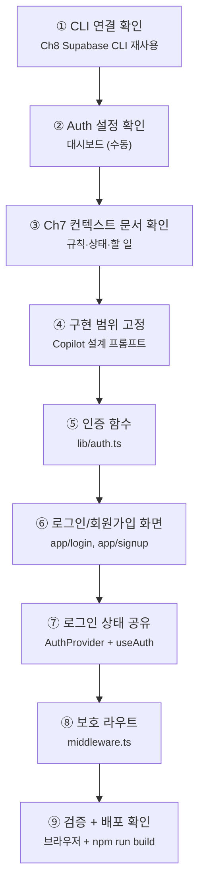

# Chapter 9. Supabase Authentication

챕터별로 새로운 세션으로 시작하며 아래의 프롬프트로 시작한다.  " 이 프로젝트를 검토 이해한다. 오늘은 ch9A.md 작업을 수행한다.  응답은 한국어로 하고 설명은 이해하기 쉽게 한다.  "

> **미션**: 내 블로그(`my-first-web`)에 이메일/비밀번호 로그인, 회원가입, 로그아웃을 연결한다
> 

---

## 이 장의 흐름

이번 장은 **핵심 코드는 최소로 읽고, 구현은 바이브코딩으로 진행**한다. 직접 손이 필요한 것은 Supabase 대시보드 설정 확인과 브라우저 테스트뿐이다.



| 단계 | 작업 | 도구 | 절 |
| --- | --- | --- | --- |
| ① | Ch8 Supabase CLI 연결 재확인 | Supabase CLI | 9.2 |
| ② | Email Provider, URL Configuration 확인 | 대시보드 (수동) | 9.3 |
| ③ | Ch7 컨텍스트 문서 검토 | Copilot + 문서 | 9.4 |
| ④ | 인증 흐름과 파일 범위 고정 | Copilot | 9.5 |
| ⑤ | 로그인/회원가입/로그아웃 함수 작성 | Copilot | 9.6 |
| ⑥ | 로그인/회원가입 페이지 작성 | Copilot | 9.7 |
| ⑦ | AuthProvider와 Header UI 연결 | Copilot | 9.8 |
| ⑧ | 보호 라우트 설정 (`middleware.ts`) | Copilot | 9.9 |
| ⑨ | 시나리오 검증 + 빌드 | 브라우저 + 터미널 | 9.10 |

**고정 버전** (Ch7·Ch8 교재 기준):

| 패키지 | 버전 |
| --- | --- |
| `next` | 16.2.1 |
| `@supabase/supabase-js` | 2.47.12 |
| `@supabase/ssr` | 0.5.2 |

> **기준 명시**: 이 장의 코드·패키지 버전은 최신 npm 기준이 아니라 **Ch7·Ch8 교재 기준에 맞춘다**. 단, Supabase 대시보드 메뉴 경로는 2026년 5월 현재 화면 기준으로 안내한다. Ch8에서 사용한 `NEXT_PUBLIC_SUPABASE_ANON_KEY` 환경변수 이름도 그대로 유지한다.
> 

---

## 학습목표

1. 인증(Authentication)과 인가(Authorization)의 차이를 설명할 수 있다
2. Supabase Auth의 이메일/비밀번호 로그인을 프로젝트에 연결할 수 있다
3. 로그인 상태를 전역 UI에서 사용할 수 있다
4. 로그인하지 않은 사용자의 글쓰기 접근을 막을 수 있다

---

## 9.1 왜 인증인가?

Ch8에서는 더미 데이터를 Supabase 데이터베이스로 교체했다. 이제 블로그에 글을 쓰려면 **누가 쓴 글인지** 알아야 한다. 이것이 인증이다.

> **원리 — 인증(Authentication) vs 인가(Authorization)**
> 

>

> | 구분 | 인증 | 인가 | | --- | --- | --- | | 질문 | "당신은 누구인가?" | "당신은 무엇을 할 수 있는가?" | | 예시 | 로그인 | 내 글만 수정 가능 | | 이 수업에서 | Ch9 | Ch11 RLS |
> 

이번 장에서는 **이메일/비밀번호 로그인**만 다룬다. Google, 카카오, 네이버 로그인은 넣지 않는다. 기능을 늘리기보다 먼저 가장 단순한 인증 흐름을 끝까지 연결한다.

> **원리 — 세션**
> 

>

> Supabase Auth는 로그인 성공 후 세션을 만든다. Next.js App Router에서는 `@supabase/ssr`가 쿠키 기반 세션 처리를 돕는다. 그래서 이 장의 프롬프트에는 항상 `@supabase/ssr`와 App Router를 명시한다.
> 

---

## 9.2 Ch8 Supabase CLI 연결 확인 `⌨️ CLI`

Ch8에서 Supabase CLI를 이미 설치하고 로그인·프로젝트 링크까지 했다. Ch9도 같은 Supabase 프로젝트를 이어서 사용하므로, 대시보드로 가기 전에 CLI 연결 상태를 먼저 확인한다.

```bash
# 1) Supabase CLI가 실행되는지 확인
npx supabase --version

# 2) 내 계정의 프로젝트 목록 확인
npx supabase projects list
```

`my-first-web` 프로젝트가 보이면 Ch8에서 만든 프로젝트를 계속 사용할 수 있다.

프로젝트 참조 ID를 확인한 뒤, Ch8에서 만든 `.env.local` 값과 비교한다.

```bash
# 3) API URL과 anon key 재확인
npx supabase projects api-keys --project-ref 프로젝트참조ID

예시: npx supabase projects api-keys --project-ref citgmhsbetcguolnotlt
```

`.env.local`에는 Ch8과 같은 이름을 사용한다.

```bash
NEXT_PUBLIC_SUPABASE_URL=https://프로젝트참조ID.supabase.co
NEXT_PUBLIC_SUPABASE_ANON_KEY=eyJhbGci...
```

만약 프로젝트 링크가 끊어졌거나 다른 폴더에서 작업 중이면 다시 연결한다.

```bash
npx supabase link --project-ref 프로젝트참조ID
```

> 이 절은 Ch8에서 어렵게 설치한 Supabase CLI를 재사용하는 확인 단계다. Auth Provider 설정 자체는 메뉴 확인이 더 안전하므로 다음 절에서 대시보드로 확인한다.
> 

---

## 9.4 Ch7 기준 문서 정비와 확인 `🤖 바이브코딩`

Ch9는 Ch7에서 만든 AI 컨텍스트 문서를 이어서 사용한다. 새 기능을 만들기 전에 Copilot이 프로젝트 규칙, 현재 상태, 남은 할 일을 먼저 읽게 해야 한다. 이 절에서는 문서가 없으면 만들고, 이미 있으면 Ch9 기준과 충돌하는 내용을 정비한다.

| 문서 | 역할 | Ch9에서 정비할 것 |
| --- | --- | --- |
| `.github/copilot-instructions.md` | 코딩 규칙 | App Router, Tailwind, shadcn/ui, `next/navigation` 규칙 |
| `context.md` | 현재 상태 | Ch8 Supabase 연결 완료 여부, 환경변수 이름 |
| `todo.md` | 할 일 | 로그인/회원가입/글쓰기 보호 항목 |
| `ARCHITECTURE.md` | 프로젝트 설계 | 인증 후 페이지 흐름, Header 구조, 보호할 경로 |
| `AGENTS.md` | 여러 AI 도구 공용 규칙 | Copilot 외 도구를 쓸 때 공통 기준 |
| `CLAUDE.md` | Claude용 규칙 | Claude Code를 함께 쓸 때 Ch7·Ch8 기준 유지 |
| `.agent/rules/project.md` | Antigravity용 규칙 | Antigravity를 함께 쓸 때 프로젝트 규칙 유지 |

> 실제 `package.json`이 교재 기준보다 최신일 수 있다. 이 경우 최신 내용을 삭제하지 말고, 문서에 **교재 기준**과 **현재 설치 기준**을 함께 남긴다.
> 

### Copilot 프롬프트 1: 기준 문서 정비

```
#file:context.md #file:todo.md #file:ARCHITECTURE.md

Ch9 Supabase Auth 작업을 시작하기 전에 기준 문서들을 정비해줘.

대상:
- .github/copilot-instructions.md
- context.md
- todo.md
- ARCHITECTURE.md
- AGENTS.md
- CLAUDE.md
- .agent/rules/project.md

작업 규칙:
1. 파일이 없으면 Ch7 기준에 맞춰 새로 만들어줘.
2. 파일이 있으면 내용을 읽고 Ch9 기준과 충돌하는 부분을 찾아줘.
3. 충돌하는 부분은 바로 수정해줘.
4. 단, 기존 프로젝트 상태나 실제 package.json과 충돌할 수 있는 부분은 삭제하지 말고 "교재 기준"과 "현재 설치 기준"을 함께 적어줘.
5. 수정 후 어떤 파일을 만들었고, 어떤 파일을 바꿨는지 요약해줘.

Ch9 기준:
- 코드·패키지 설명은 Ch7·Ch8 교재 기준을 따른다.
- Next.js 16.2.1 App Router
- @supabase/supabase-js 2.47.12
- @supabase/ssr 0.5.2
- Supabase 대시보드 메뉴 안내만 2026년 5월 기준이다.
- Ch8 환경변수 이름을 유지한다:
  NEXT_PUBLIC_SUPABASE_URL
  NEXT_PUBLIC_SUPABASE_ANON_KEY
- 이메일/비밀번호 인증만 사용한다.
- 소셜 로그인은 추가하지 않는다.
- App Router만 사용한다.
- next/router, pages router는 사용하지 않는다.
- 이 교재에서는 보호 라우트 파일로 middleware.ts를 사용한다.
- Supabase Auth 로그인은 signInWithPassword를 사용한다.
- 구버전 auth.signIn()은 사용하지 않는다.
- service_role 키는 클라이언트에 절대 두지 않는다.

버전 표기는 다음 정책으로 정리해줘:

## Version Policy

- 교재 기준: Next.js 16.2.1, @supabase/supabase-js 2.47.12, @supabase/ssr 0.5.2
- 실제 package.json이 더 최신일 수 있다.
- 수업 프롬프트와 설명은 교재 기준으로 통일한다.
- 빌드 오류가 버전 차이에서 발생하면 package.json 기준으로 원인을 확인한다.

출력:
- 생성한 파일
- 수정한 파일
- 충돌해서 정리한 항목
- 아직 사람이 확인해야 할 항목
```

### Ch9에서 문서에 추가할 사항

Ch9 작업이 끝나면 아래 내용을 각 문서에 남긴다.

| 문서 | 추가할 내용 |
| --- | --- |
| `.github/copilot-instructions.md` | 이메일/비밀번호만 사용, `next/router` 금지, 구버전 `auth.signIn()` 금지 |
| `context.md` | Supabase Auth 방식, 생성한 파일, 보호 라우트, URL Configuration 설정 |
| `todo.md` | 회원가입, 로그인, 로그아웃, `/posts/new` 보호, 배포 검증 체크 |
| `ARCHITECTURE.md` | 인증 흐름, Header 상태 분기, 보호 라우트 목록 |
| `AGENTS.md` | 여러 AI 도구 공통 규칙: Ch7·Ch8 패키지 기준, Supabase 메뉴만 2026년 5월 기준 |
| `CLAUDE.md` | Claude 사용 시에도 위 공통 규칙과 Ch9 인증 범위 유지 |
| `.agent/rules/project.md` | Antigravity 사용 시 App Router, Supabase Auth, 보호 라우트 기준 유지 |

---

## 9.5 코드 변경 범위 고정 `🤖 바이브코딩`

9.4에서 정비한 기준 문서를 바탕으로, 이제 실제로 어떤 코드 파일을 만들고 수정할지만 확정한다. 이 절에서는 문서를 더 고치지 않고, 코드 변경 범위만 정리한다.

### Copilot 프롬프트 2: 파일 범위 확인

```
9.4에서 정비한 context.md, todo.md, ARCHITECTURE.md, copilot-instructions.md 기준을 반영해서
Ch9 인증 구현의 코드 변경 범위만 정리해줘.

이 프로젝트는 Ch7·Ch8 교재 기준으로 Next.js 16.2.1 App Router,
@supabase/supabase-js 2.47.12, @supabase/ssr 0.5.2를 사용한다.

Ch9 목표는 이메일/비밀번호 회원가입, 로그인, 로그아웃, 로그인 상태 유지,
그리고 /posts/new 보호 라우트 구현이다.

아직 코드는 수정하지 마.
문서 파일도 더 수정하지 마.
현재 프로젝트 구조를 확인한 뒤 실제 코드 파일의 생성/수정 목록과 각 파일의 역할만 제안해줘.

규칙:
- App Router만 사용한다.
- pages router, next/router는 사용하지 않는다.
- 소셜 로그인은 추가하지 않는다.
- 새 라이브러리는 추가하지 않는다.
- Supabase 클라이언트는 @supabase/ssr 패턴을 사용한다.
```

Copilot 답변을 받은 뒤, 아래 필수 파일들이 포함되었는지 다시 확인시킨다.

```
방금 제안한 코드 변경 범위에 아래 필수 파일이 모두 포함되어 있는지 확인해줘.

필수 확인 목록:
- lib/auth.ts: 로그인, 회원가입, 로그아웃 함수
- contexts/AuthContext.tsx 또는 components/AuthProvider.tsx: 로그인 상태 전역 공유
- app/login/page.tsx: 로그인 화면
- app/signup/page.tsx: 회원가입 화면
- app/layout.tsx: AuthProvider 연결
- app/posts/new/page.tsx: 로그인 필요 화면
- middleware.ts: 비로그인 사용자를 /login으로 이동

출력:
- 포함된 파일
- 빠진 파일
- 현재 프로젝트 구조상 다른 경로를 써야 한다면 그 이유

아직 코드는 수정하지 마.
```

---

## 9.6 인증 함수 만들기 `🤖 바이브코딩`

이 절에서는 `lib/auth.ts`만 만든다. 핵심 함수는 3개다.

`lib/auth.ts`는 Supabase 인증 호출을 한곳에 모아 두는 파일이다. 로그인 화면과 회원가입 화면이 Supabase API를 직접 반복해서 쓰지 않고, `signInWithEmail`, `signUpWithEmail`, `signOut` 같은 쉬운 이름의 함수만 호출하게 만든다. 이렇게 해 두면 나중에 에러 처리나 함수 이름이 바뀌어도 화면 파일을 많이 고치지 않아도 된다.

### Copilot 프롬프트 3: `lib/auth.ts`

```
lib/auth.ts 파일을 만들어줘.

요구사항:
- 이메일/비밀번호 로그인: signInWithEmail(email, password)
- 이메일/비밀번호 회원가입: signUpWithEmail(email, password, name)
- 로그아웃: signOut()
- Supabase 클라이언트는 기존 lib/supabase/client.ts의 createClient()를 사용한다.
- signInWithPassword, signUp, signOut만 사용한다.
- 구버전 auth.signIn()은 사용하지 않는다.
- 에러를 숨기지 말고 호출한 컴포넌트가 처리할 수 있게 반환한다.
```

AI가 `lib/auth.ts`를 만든 뒤, 아래 패턴을 사용했는지 다시 확인시킨다.

```
방금 만든 lib/auth.ts를 검토해줘.

반드시 확인할 것:
1. 로그인은 supabase.auth.signInWithPassword({ email, password })를 사용하는가?
2. 회원가입은 supabase.auth.signUp({ email, password, options: { data: { name } } }) 패턴을 사용하는가?
3. 로그아웃은 supabase.auth.signOut()을 사용하는가?
4. 구버전 supabase.auth.signIn(...)이 남아 있지 않은가?
5. service_role 키나 서버 전용 키를 사용하지 않았는가?

문제가 있으면 바로 수정해줘.
수정 후 어떤 줄을 바꿨는지 요약해줘.
```

---

## 9.7 로그인/회원가입 화면 만들기 `🤖 바이브코딩`

화면은 예쁘게 꾸미기보다 먼저 동작해야 한다. 입력칸, 버튼, 에러 메시지, 이동만 있으면 된다.

로그인 페이지와 회원가입 페이지는 사용자가 인증 기능을 실제로 만나는 입구다. 이 화면들은 Supabase 로직을 직접 길게 쓰기보다 9.6에서 만든 `lib/auth.ts` 함수를 호출하는 역할만 맡는다. 그래서 화면 파일은 입력값 관리, 버튼 클릭, 성공 후 이동, 실패 메시지 표시 정도로 단순하게 유지한다.